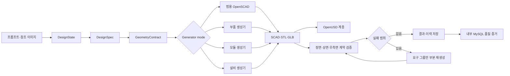

# 범용 OpenSCAD 유지 + 도메인 파라메트릭 생성기 전체 계획

기준일: 2026-07-22

## 결정 사항

기존 범용 OpenSCAD 생성기는 삭제하거나 대체하지 않는다. 자유 형상 또는 아직 도메인 템플릿이 없는 요청의 안전한 fallback으로 계속 유지한다. 그 위에 자동 분류와 부품·모듈·설비별 파라메트릭 생성기를 추가한다.

| 모드 | 역할 | 적용 기준 |
|---|---|---|
| `openscad` | 기존 범용 템플릿 | 자유 형상, 미지원 도메인, 명시적 범용 선택 |
| `openscad_auto` | 자동 추천 | 카테고리와 요구사항을 분석해 아래 전문 모드 선택 |
| `openscad_part` | 부품 생성기 | 브래킷, 플레이트, 홀, 리브 등 단품 |
| `openscad_module` | 모듈 생성기 | 베이스, 가이드, 구동기, 지그, 센서 조립 |
| `openscad_equipment` | 설비 생성기 | 프레임, 컨베이어, 안전도어, 비전, 제어반 등 설비 |

기본 2D 경로는 로컬 ComfyUI/FLUX 계열이며 OpenAI Image API는 추가 모드다. OpenAI 실호출은 API 키가 준비되어 있어도 사용자에게 먼저 알리고 입력을 기다린 뒤에만 수행한다. 현재 인증과 품질 증거는 내부 Docker MySQL을 사용하며 외부 사내 MySQL 인증 연결은 후속 결정으로 보류한다.

## 전체 파이프라인

## 단계별 계획과 현재 상태

| 단계 | 내용 | 현재 상태 |
|---|---|---|
| 1 | 운영 차단요인 감사: 인증 헤더, 저장소 URL, 마이그레이션 실행 위치 | 완료 |
| 2 | 범용 OpenSCAD 보존, 자동/수동 엔진 선택과 fallback | 완료 |
| 3 | 공통 DesignSpec·GeometryContract와 결정적 seed/hash | 완료 |
| 4 | 부품 생성기: 외형 치수, 홀, 리브, 수량 요구 | 완료 |
| 5 | 모듈 생성기: 베이스, 프레임, 가이드, 모터, 지그, 센서 | 완료 |
| 6 | 설비 생성기: 프레임, 컨베이어, 모터, 비전, 안전도어, 제어반 및 OpenUSD 계층 | 완료 |
| 7 | 3면 계약 검증, 좌표 관계 검증, 실패 요구 그룹 부분 재생성 | 완료 |
| 8 | UI, API, Celery, 내부 MySQL 이력, 품질 증거, Mock E2E 통합 | 완료 |
| 9 | 독립 도메인 홀드아웃으로 95% 목표 판정 | 평가기·자가피드백 루프 완료, 600건 홀드아웃 데이터 검증 전 |
| 10 | 외부 사내 MySQL/사내 인증 연결 | 보류 |
| 11 | OpenAI Image API 재현율 비교 | 사용자 호출 후 진행 |

## 생성기별 확장 범위

### 부품

- 브래킷, 플레이트, 커버, 스페이서
- 원형·장공·카운터보어·카운터싱크
- 리브, 모따기, 필렛, 대칭·배열
- 소재, 판두께, 홀 공차와 체결 규격
- 후속: STEP/B-Rep와 PMI를 위한 OpenCascade 기반 정밀 커널 병행

### 모듈

- 베이스 플레이트와 구조 프레임
- 리니어 가이드, 액추에이터, 서보·감속기
- 작업 지그, 센서, 케이블 여유 공간
- 조립 기준면, 정비 접근성, 간섭·스트로크 검사
- 후속: 표준 부품 카탈로그와 BOM 연결

### 설비

- 알루미늄 프로파일 또는 용접 프레임
- 컨베이어·로봇·공정 유닛·비전·제어반
- 안전도어, 라이트커튼, 작업자 투입구
- OpenUSD assembly prim, requirement ID, variant/layer
- 후속: 안전 거리, 유지보수 동선, 로봇 작업공간, 설비 간 인터페이스 계약

## 검증과 부분 재생성 계약

1. 전체 외곽 치수를 실제 메시와 계약 투영에서 검사한다.
2. 필수 구성요소가 3면 중 최소 두 시점에 나타나는지 검사한다.
3. 위·아래, 좌·우, 앞·뒤 관계를 구성요소 중심 좌표로 검사한다.
4. 실패한 관계의 주체 requirement ID만 재생성 범위로 만든다.
5. 부분 재생성 시 비대상 구성요소는 기존 GeometryContract 값을 그대로 보존한다.
6. 외곽 치수가 변경되면 부분 재생성을 중단하고 전체 재생성으로 안전하게 전환한다.
7. 요구 그룹 ID와 실제 물리 component ID를 별도 기록한다.

3면 검증은 같은 GeometryContract에서 산출한 `contract_projection`이며 독립 평가가 아니다. 따라서 이 결과만으로 실제 장비와 95% 일치한다고 주장하지 않는다.

## 95% 목표의 판정 방식

현재 통과한 값은 구현·기술 계약이다.

- 네이티브 부품·모듈·설비 대표 케이스: 3/3
- 각 케이스의 치수, 메시, 요구사항 coverage, 3면 계약, OpenUSD hierarchy: PASS
- Worker 테스트: 66/66
- Control Plane 테스트: 12/12
- 내부 HTTP 부분 재생성 E2E: PASS

실제 도메인 적중률 95%는 아래 독립 홀드아웃을 완료한 뒤에만 선언한다.

- 최소 600건: 부품·모듈·설비 각 200건
- 학습·튜닝에 쓰지 않은 고정 prompt/spec/참조 도면
- 각 모드 관측 성공률 95% 이상
- 각 모드 Wilson 95% 신뢰구간 하한 95% 이상
- 치수, 수량, 구성, 배치, 간섭, 파일 유효성 항목을 분리 채점
- 계약 생성기와 분리된 평가기 및 사람 설계 검토 이중 판정
- 제조 승인, 안전 인증, 공차 보증은 별도 엔지니어 승인 절차

목표에 못 미치는 유형은 전체 모델을 다시 만들지 않고 requirement별 실패 분포를 기준으로 템플릿, 제약식, 표준 부품 매핑을 개선한다.

## 다음 고도화 우선순위

1. 도메인 스키마 확대: 부품 형상 20종, 모듈 15종, 설비 셀 10종 이상.
2. 표준 부품/BOM: 모터, 가이드, 프로파일, 센서의 실제 카탈로그 치수와 공급사 ID 연결.
3. 기하 제약: 간섭, 최소 간격, 스트로크, 도어 개방, 정비 접근성 검사.
4. STEP/B-Rep 병행: OpenSCAD를 빠른 구조 생성기로 유지하고 정밀 제조 출력은 OpenCascade 계열로 승격.
5. 독립 평가 세트: 600건 고정 홀드아웃과 사람 검수 UI.
6. 실패 기반 개선: 요구 그룹별 부분 재생성 통계와 회귀 방지 baseline.
7. 운영 관측성: 생성 시간, 실패율, 모드 선택, 재생성 횟수, 품질 증거를 MySQL 대시보드화.
8. 외부 연동: 승인 후 사내 MySQL read-only probe → shadow auth → 제한 사용자 → 전체 전환.
9. OpenAI 추가 모드: 사용자 확인 후 기존 프롬프트 제약을 그대로 적용해 다른 2D 파이프라인과 재현율만 비교.

## 현재 증거

- 네이티브 보고서: `storage/e2e-evidence/20260722-parametric-native/native_validation_report.json`
- 네이티브 요약: `storage/e2e-evidence/20260722-parametric-native/NATIVE_VALIDATION_REPORT.md`
- 다중 시점/실패 주입: `storage/e2e-evidence/20260722-multiview-contract/MULTIVIEW_VALIDATION_REPORT.md`
- HTTP 부분 재생성: `storage/e2e-evidence/20260722-parametric-web-r3/partial-regeneration-e2e.json`
- 기존 브라우저 E2E: `storage/e2e-evidence/20260722-parametric-web-r2/E2E_VALIDATION_REPORT.md`
- 최종 UI·계획·자가피드백 보고서: `docs/FINAL_UIUX_PLAN_SELF_FEEDBACK_REPORT_20260722_KO.md`
- 기존 OpenAI 실패 기준선: `storage/e2e-evidence/20260722-self-feedback/openai-baseline.json`
- 전문 부품 기준선: `storage/e2e-evidence/20260722-self-feedback/specialized-part-baseline.json`

현재 전문 부품의 제조 구조 검사는 100%지만 독립 외관 점수는 50.57%이므로 95% 목표는 미달성이다. 최대 3회 제한·최고 후보 보존·Wilson 하한 판정은 구현됐으며, 부품·모듈·설비 각 200건의 독립 홀드아웃이 채워지기 전에는 달성을 선언하지 않는다.

## 2026-07-23 설비 카탈로그 상세 고도화

다른 프로젝트는 사용자의 범위 지시에 따라 읽기 전용으로만 조사했다. 현재 프로젝트에는 카탈로그 기반 설비 구성 원칙만 독립적으로 반영했으며, 다른 프로젝트의 파일은 수정·추가·삭제하지 않았다.

`openscad_equipment` 생성기 1.1.0에는 다음 상세 계약을 추가했다.

- 컨베이어: 좌우 사이드 레일 2개, 구조 지지대 4개
- 비전 카메라: 카메라 하우징 1개 안에 렌즈 2개
- 전면 안전문: 투명 패널, 프레임 4개, 손잡이 1개
- 제어반: 도어, HMI, 손잡이, 비상정지 버튼
- Blender: HMI·비상정지·렌즈·손잡이 재질 분리와 투명 패널 알파 블렌드
- 제조 평가: `assembly_detail_contract`로 9개 상세 규칙의 수량 충족을 별도 검사

고정된 로컬 FLUX `CONCEPT-2`를 기준으로 동일 입력 E2E를 다시 실행한 결과:

- 기존 최고 실루엣 점수: 0.6339
- 상세 생성기 1.1.0 점수: 0.6351
- 상대 개선: 약 0.19%
- 제조 형상 점수: 0.9999, PASS
- 상세 계약: 1.0000, 9/9 PASS
- 치수 최대 오차: 0.125%, PASS
- OpenUSD 단일 파일 및 레이어 패키지: parser valid
- Python worker 전체 회귀: 75/75 PASS

투명 패널의 디더링 노이즈는 알파 블렌드로 제거했다. 128 렌더 샘플은 단독 외관 점수 개선 없이 Blender 시간이 134초에서 232초로 증가했으므로 채택하지 않았고, 알파 블렌드는 유지하면서 64 샘플로 복귀했다. 최종 revision 6의 Blender 시간은 106초로 줄었으며 점수와 모든 제조·USD PASS를 유지했다.

이 개선은 구조·상세 계약에는 유효하지만 독립 외관 목표 0.95에는 아직 미달한다. 다음 핵심 과제는 블록 조합 추가가 아니라 참조 이미지에서 프레임·컨베이어·제어반·카메라의 2D 위치와 카메라 자세를 추정해 파라메트릭 배치에 전달하는 비전 파서다.

OpenUSD 의미 계층도 함께 보강했다. 기존에는 `assembly.usda`에 컴포넌트가 존재해도 검증기가 루트 파일 문자열만 세어 `assembly_component_count=0`으로 보고했고, 원통 primitive의 Assembly bbox 크기가 0으로 기록됐다. 수정 후 합성된 Stage 속성을 직접 순회하며, 단일 USDA/USDC 메시에도 `componentId`, `kind`, `requirementId`를 기록한다. revision 6 재패키징 결과는 단일/레이어 패키지 모두 45 meshes, 45 semantic components, parser valid이며 컨베이어 롤러 bbox는 `(0.045, 0.300, 0.045)m`로 검증됐다.

## 2026-07-23 로컬 독립 외관 고도화와 전체 파이프라인 회귀

외부 API와 외부 사내 DB를 사용하지 않고 로컬 스택만으로 다시 검증했다. OpenAI Image API는 호출하지 않았다.

### 이번에 해결한 실제 결함

1. 영어 치수의 숫자 우선 표현인 `1600mm width`를 2D 분석 JSON이 누락하던 문제를 수정했다. 단어 우선·숫자 우선 표현과 mm/cm/m 변환을 모두 지원한다.
2. 2D 분석의 일반 요약 부품보다 저장된 `design_spec.components`를 3D `DesignState`가 우선 사용하도록 해, 라우팅과 실제 형상 계약의 부품 ID·수량을 일치시켰다.
3. 독립 외관 평가에서 진단용 정투영 이미지가 최종 Blender 렌더의 낮은 점수를 숨기지 못하도록, 첫 번째 최종 렌더만 품질 게이트에 사용한다.
4. Blender 로컬 Workbench 12포즈 탐색을 추가하고 최종 EEVEE 렌더에는 선택 포즈를 재사용한다.
5. glTF를 Blender로 가져올 때 원래 Z 높이가 Blender Y축으로 들어온 좌표 오류를 발견했다. 요구 외곽 치수와 가져온 장면 외곽을 비교해 필요한 경우 X축 -90° 보정을 적용한다.
6. Blender 최종 GLB 내보내기 후 Y/Z가 다시 교환되는 경우에도 같은 치수 계약으로 축을 파일에 베이크하고 재로드 검증한다.
7. 회의 분석 규칙에 서보모터, 안전도어, 제어반, 비전 카메라, 컨베이어 등 설비 동의어를 추가했다.

### 설비 생성기 1.2.0

기존 `standard_cell`은 그대로 유지한다. 비전 검사 문맥에서만 별도 `vision_inspection_cell` 레이아웃을 선택한다.

- 전면 방향으로 돌출된 롤러 컨베이어
- 셀 상부 외부 비전 카메라와 좌우 렌즈, 하향 광학계
- 우측 독립 제어반, HMI, 비상정지, 상태 버튼
- 전면 투명 안전도어, 4면 프레임, 손잡이, 힌지
- 밝은 알루미늄 프레임과 은색 컨베이어 재질
- 기존 9개 조립 상세 계약과 범용 OpenSCAD fallback 보존

### 실제 로컬 E2E 결과

| 구간 | 결과 |
|---|---|
| 로컬 음성 인식 | Faster-Whisper 실제 한국어 WAV를 10.6초에 처리, `faster-whisper local` 제공자 확인 |
| 회의 요구사항 분석 | 서보모터·안전도어·제어반·비전 카메라·컨베이어 5종과 1600×1000×1800mm 추출 |
| 로컬 2D | ComfyUI FLUX 4안, 76.212초, 4/4 PNG 품질 게이트 PASS |
| 2D 추천 | `CONCEPT-1`, 계약 투영 정합 점수 0.5983 |
| 구조 3D | 네이티브 OpenSCAD, 형상·치수·3면 관계·상세 계약 PASS |
| 최종 3D | Blender final revision 8, 전체 88.798초, 12포즈 중 `front_right_15_low` 선택 |
| 최종 GLB | 55 meshes, 실제 외곽 `(1.600000, 1.000000, 1.800000)m`, 치수 점수 1.0 |
| 제조 구조 | 독립 기하 점수 1.0, watertight·양의 부피·치수 계약 PASS |
| OpenUSD | 55 stage meshes, 55 semantic assembly components, parser valid |
| 외관 독립 점수 | 0.5883, 목표 0.95 미달 |
| 워커 회귀 | 84/84 PASS |

과거 0.60대 외관 점수 중 일부는 Blender에 높이 축이 Y로 들어온 상태에서 측정돼 현재 Z-up 기준선과 직접 비교할 수 없다. revision 8의 0.5883을 올바른 좌표·레이아웃을 사용하는 새 기준선으로 삼는다. 제조 구조 1.0과 외관 0.5883은 서로 다른 지표이며, 제조 승인이나 외관 95% 달성을 의미하지 않는다.

### 다음 로컬 고도화 순서

1. 참조 이미지에서 프레임·컨베이어·카메라·제어반의 2D 박스와 가림 관계를 추출하는 로컬 비전 파서
2. 3/4 시점과 카메라 고도·초점거리를 별도 추정하는 시점 분류기
3. `vision_inspection_cell`의 셀 폭, 컨베이어 돌출량, 제어반 간격, 카메라 높이를 제한 범위에서 탐색하고 최고 후보만 보존하는 레이아웃 최적화
4. 단순 실루엣과 분리된 구성요소 배치 평가기 및 사람 검수 라벨
5. 설비 유형별 고정 홀드아웃과 실패 분포를 이용한 회귀 게이트

### 최신 증거

- 로컬 FLUX 원본: `storage/projects/PRJ-LOCAL-REGRESSION-002/concepts/concept-1.png`
- 최종 렌더: `storage/projects/PRJ-LOCAL-REGRESSION-002/result/high_quality/render_high_quality-final-r8.png`
- 최종 GLB: `storage/projects/PRJ-LOCAL-REGRESSION-002/result/high_quality/model_high_quality-final-r8.glb`
- 카메라·좌표 보고서: `storage/projects/PRJ-LOCAL-REGRESSION-002/result/high_quality/camera_search_report-final-r8.json`
- 독립 평가: `storage/projects/PRJ-LOCAL-REGRESSION-002/result/self_feedback_report-final-r8.json`
- 자산 검증: `storage/projects/PRJ-LOCAL-REGRESSION-002/result/validation_report-final-r8.json`
- OpenUSD: `storage/projects/PRJ-LOCAL-REGRESSION-002/result/model.usdc`
